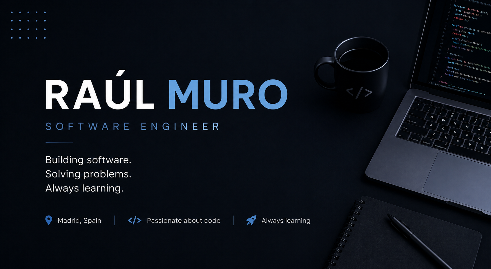

  

# 👋 Hey, I'm Raúl!

### Software Engineer | Java Developer | DAM Graduate

I'm a Software Engineering enthusiast from Madrid, Spain, passionate about building software, solving problems and continuously learning new technologies.

Currently, I'm focused on Java development, Android applications and software quality, while expanding my knowledge in cloud technologies and backend development.

---

## 🚀 About Me

- 💻 DAM Graduate (Multiplatform Application Development)
- ☕ Passionate about Java and Software Engineering
- 📱 Interested in Android Development
- 🧪 Experience with Software Testing and Test Automation
- ☁️ AWS Cloud Quest – Cloud Practitioner
- 🌱 Always learning new technologies

---

## 🛠 Tech Stack

### Languages

### Development

### Testing

### Tools

---

## 📌 Featured Projects

🔹 CyberSecurityMonitor

Java application that monitors running processes and detects suspicious activity.

🔹 Secure Java Chat

Client-server encrypted chat developed with Java sockets and AES encryption.

🔹 Connect Four Client-Server

Network multiplayer implementation of the classic Connect Four game.

🔹 Android Fundamentals

Android application showcasing activities, intents, persistence and UI components.

---

## 📫 Connect with me

- 💼 LinkedIn: www.linkedin.com/in/raúl-muro-simón-25a958337
- 📧 Email: raulmurosimon@gmail.com

---
⭐ Feel free to explore my repositories!
